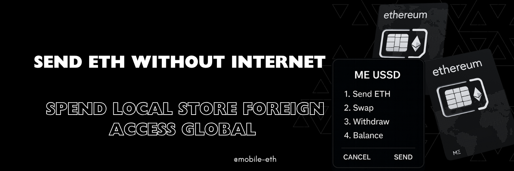

<!--  -->

</br>

[](https://github.com/stk2chain/stk2eth/actions/workflows/ci.yml)
[](https://github.com/stk2chain/stk2eth/actions/workflows/deploy.yml)
[](https://codecov.io/gh/stk2chain/stk2eth)
[](https://opensource.org/licenses/MIT)
[](https://www.rust-lang.org)

<!-- 
  

 -->
<!-- markdownlint-disable-next-line MD036 -->


# Mobile-ETH

### Problem: 
> ### tl;dr: Feature phones (no internet) need secure Ethereum access.

Users in areas with **limited internet infrastracture *(No internet)*** need secure access to **decentralized finance and Web3 services**.

### Solution: 
**An Account Abstraction eSIM ToolKit *(eSTK)*  and USSD Wallet that enables offline User Transaction relays over USSD. *(No internet required)*.**

**Account Abstraction eSIM Wallet -: USSD → Ethereum → SMS (No internet required)**
<!-- >**USSD (Unstructured Supplementary Service Data)** - a communications protocol used by GSM mobile phones to interact with a service provider's computers in real-time. -->

<!-- >**eSTK (SIM Application Toolkit)** - a standard of the GSM system which enables the **SIM Card (Subscriber Identity Module)** initiate actions usable for various value-added services. A more general name for this class of **Java Card-based applications running on UICC cards** is the **Card Application Toolkit (CAT)**. -->

<!-- Over **95% of the world's population has access to GSM networks** -->

<!-- A protocol designed to **bridge traditional mobile networks *(GSM)*** with **blockchain systems**.  -->

</br>

## Demo: <a href="https://v0-mobile-eth.vercel.app/ussd/demo" target="_blank">Mobile ETH USSD Simulator</a> (*Try without setup.*)

</br>


<!-- ## Project Overview -->

<!-- **An Account Abstraction eSIM ToolKit *(eSTK)*  and USSD Wallet that Relays User Transactions over USSD. *(No internet required)*.** -->
<!-- Making Ethereum accessible to users in areas with limited internet infrastructure but high mobile penetration -->

<!-- **STK2ETH** is an **Account Abstraction eSIM Toolkit (eSTK) and USSD Wallet** that **enables Ethereum Transactions over USSD** without requiring internet connectivity. This project bridges the gap between traditional mobile networks and blockchain technology, making Ethereum accessible to users in areas with limited internet infrastructure but high mobile penetration. -->

<!-- ## Project Vision -->

<!-- Enable billions of mobile users worldwide to access Ethereum blockchain services using only their basic mobile phones through USSD technology, democratizing access to decentralized finance and Web3 services. -->

<!--**STK2ETH: Send ETH *(No internet required)*.**-->

<!-- This doc specifies the STK2ETH protocol, including the USSD-ETH Gateway (short: *4337#), a USSD gateway enabling offline User Transaction relays for AA wallets. -->

<!-- - <details><summary>System Schematics</summary>
    
 -->

<!-- ## Quickstart -->
### Setup

1. **Install SpacetimeDB CLI**
   ```bash
   curl -sSf https://spacetime.dev/install.sh | sh
   ```

2. **Start SpacetimeDB**
   ```bash
   spacetime start
   ```

### Deployment

1. **Clone the repository**
   ```bash
   git clone https://github.com/stk2chain/stk2eth.git  
   cd stk2eth
   ```

2. **Build and deploy `ussdgeth` module on SpacetimeDB**
   ```bash
   spacetime publish -c --server local --project-path ussdgeth gateway2
   ```
   (You may replace `gateway2` with any valid URL-safe name.)
3. **Start USSD client**
   ```bash
   cd ../ussdclient
   python ussdclient.py
   ```
4. **Start ETH client**
   ```bash
   cd ../ethclient
   python ethclient.py
   ```
5. **Start SMS client**
   ```bash
   cd ../client
   python smsclient.py
   ```
6. **Deploy smart contracts (local)**
   ```bash
   cd ../pyethclient/contracts
   anvil &  # Start local Ethereum node
   ape run deploy
   ```

### Ngrok Callback URL (For Sandbox Testing)
1. Start ngrok to expose `ussdclient`'s HTTP Port
   ```bash
   ngrok http 5000
   ```
2. Copy the ngrok URL and configure it in your USSD provider (e.g., Africa's Talking):
   ```
   Service Code: *384*6086#	
   Callback URL: https://abc123xyz.ngrok-free.app/ussdeth
   ```
3. Launch the <a href="https://v0-mobile-eth.vercel.app/ussd/demo" target="_blank">Simulator</a> and test the flow

</br>

## Components

| Component | Purpose | Technology | Status |
|-----------|---------|------------|--------|                                       
| [**ussdgeth**](../ussdgeth/README.md) | Manages USSD sessions, stores state, and processes transactions | Rust/WASM/SpacetimeDB | ✅ Active |
| [**ussdclient**](../ussdclient/README.md) | Connects USSD gateways to SpacetimeDB and relays response via HTTP/Websocket | Rust/Axum | ✅ Active |
| [**ethclient**](../ethclient/README.md) | Sends and manages On Chain transactions | Rust | ✅ Active |
| [**smsclient**](../ussd/README.md) | Sends transaction notifications via SMS | Rust/WASM | 🚧 In Development |
| [**contracts**](../ethclient/contracts/README.md) | Smart contracts for eSIM registry and account abstraction | Solidity/Ape | ✅ Active |
| [**eSTK**](../doc/specs/applet.md) | eSIM JavaCard Applet Wallet over USSD | JavaCard | 🚧 In Development |


<br/>

### [System Architecture](https://excalidraw.com/#room=719768eae4668baa540a,Bqn71eaiwgKtS8TGFQQ3qg)
